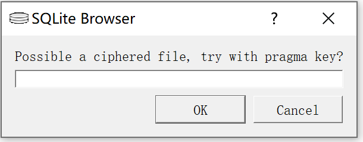
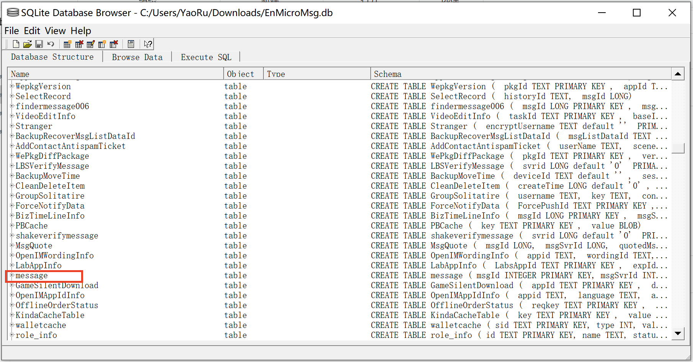

## 参考原项目
https://github.com/myth984/wechat-report

## 看看样子

没有对各个屏幕做适配 && 请用手机看(可以用浏览器-开发者工具 模拟)
https://myth.icu/wechat-report/

## 安卓版详细教程（小米手机示例）
默认具备一定git/vue/python/mysql知识

### 1. 导出微信聊天记录
参考链接:
https://github.com/BlueMatthew/WechatExporter  
https://zhuanlan.zhihu.com/p/77418711  
https://www.goyasha.com/article/202112291928/  

#### a. 备份微信数据
1. 进入 `设置->我的设备->备份恢复->手机备份恢复` ，
   然后点开 `第三方应用程序和应用数据`，仅勾选其中的微信进行备份；
   点击立即备份之后就等待备份完成。  
  
2. 备份完成之后手机连接电脑找到手机目录 `MIUI/backup/AllBackup/yyyymmdd_xxxxxx` 文件夹，
   里面可以看到一个名称类似为 `微信(com.tencent.mm).bak` 的文件。
   这个文件就是微信备份的文件，将这个文件拷贝到自己的电脑上。  
  
3. 将备份文件进行解压，进入目录 `apps\com.tencent.mm\r\MicroMsg\`，
   在该目录下找到最大的一个文件夹（一般是一串字符），从中找到一个名为 `EnMicroMsg.db` 的数据库文件。这个就是备份的聊天记录信息。
   此外还需要提取出文件 `apps\com.tencent.mm\sp\auth_info_key_prefs.xml`  

#### b. 解析备份数据
1. 接下来需要将 `EnMicroMsg.db` 的数据库文件中的数据再导出来。
   点击运行 `sqlcipher.exe`，然后点击 `File -> Open Database`。  
   选择前面导出的 `EnMicroMsg.db` 的数据库文件打开。
   这时候会出现一个弹窗提示 
   但是这个数据是加密的，我们需要先获取对应密码。

2. 获取数据库密码
   这里和前面参考链接 [微信聊天记录导出为电脑txt文件教程](https://zhuanlan.zhihu.com/p/77418711) 中的方法有些不一致。  
   原因是加密的情况有几种，具体参考了 [手机端微信聊天记录数据库解密过程](https://www.goyasha.com/article/202112291928/)。
   1) 1234567890ABCDEF + UIN 计算MD5值取前7位字符  
   2) IMEI + UIN 计算MD5值取前7位字符 

   **UIN 获取方式**
   首先打开前面提取的文件 `auth_info_key_prefs.xml`，在这个文件中可以找到 `_auth_uin` 参数, 它对应的 value 就是 UIN.
   ```xml
   ...
    <int name="_auth_uin" value="" />
   ...
   ```
   首先尝试使用 `1234567890ABCDEF + UIN` (去除 + 号) 计算32位小写 MD5 值取前 7 位字符作为密码。若无法打开则尝试第二种。

   **IMEI 获取方式**
   在电话拨号界面上输入 `*#06#`， 这时候就会出现一个弹窗，上面包括 MEID 和 IMEI。有的手机会有两个 IMEI，就需要都尝试一下了。
   使用 `IMEI + UIN` (去除 + 号) 计算32位小写 MD5 值取前 7 位字符作为密码，再次尝试打开数据库文件

3. 筛选出和 message 表有关的 sql 语句
   打开数据库文件之后可以看到很多表信息
   
   其中的 `message` 表就是保存了所有备份的聊天数据.
   点击 `File -> Export -> Database to SQL file` 将数据库数据导出为 sql 文件，导出文件命名为 `message.sql`。
   获取到的 sql 文件中还包含了其他的一些数据信息。所以这里需要对数据进行过滤，只提取其中的 `message` 表信息。  
   将 `message.sql` 文件放在 `data-process\` 目录下，然后打开。
   从中删除和 message 表无关的 sql 语句，只需要留下插入 message 表的 sql 语句即可。


### 2. 将微信聊天记录导入到本地数据库中
这一步中，首先先要在本地启动一个 mysql 数据库。
然后执行建表的 sql 文件 `creat_table.sql`；
执行成功之后，再执行前面过滤完之后的 `message.sql` 文件。
全部执行成功之后，所有的聊天记录都导入到了数据库 `message` 这个表中。


### 3. 聊天数据统计
#### a. 提取相应的聊天对象的聊天数据
1. 将需要统计的聊天对象的聊天数据统计到 log 表中    
   1. 将前面启动的数据库信息及表信息填写到配置文件 `config.yaml` 中
   2. 将需要提取的聊天对象信息填写到的 `config.yaml` 中
   3. 执行 `message2log.py` 脚本

2. 生成聊天数据统计信息，用于展示
   1. 执行脚本 `create_stat_data.py`，然后在脚本的当前目录下可以得到一个 `data.json` 文件，这个文件就是聊天数据的统计。但是其中还缺少了最多出现的词语统计。这个数据需要通过下面分词之后才能统计到。有数据之后如下格式补充到 `data.json` 文件中。
   ```json
   "mostWord": {
       "content": "哈哈哈", // 出现频率最高的词语
       "count": 1148       // 出现次次数
   }
   ```
   2. 将完成的 `data.json` 文件放到项目目录 `/wechat-report/build-page/src/` 下


### 4. 根据聊天数据生成词云
#### a. 分词
推荐使用其他分词工具 如阿里云腾讯云 可以白嫖的分词工具

如果不行可以用 `/bin/analysis.py` 这个分词脚本，不过需要二次人工过滤。  
运行这个脚本之后，会在脚本目录下生成文件 `segmentation.csv` 这个文件就是分词的统计结果。  
需要手动进行一定处理，可以手动删除一些不合理的数据，避免生成的词云看着有点怪。  

另外，这里可以获取到出现频率最高的词语，可以填写到前面步骤生成的 `data.json` 文件中。

#### b. 生成词云
1. 将分词结果传入这个网站  
https://wordart.com/create

2. 上传宋体字体文件 SIMFANG.TTF
   因为该网站不支持中文，但是可以支持自己上传字体，这样就可以支持中文  

3. 获取图片
   打开控制台执行
   ```js
   canvas = document.querySelector("#root > div > div.app-body > div.app-body-pane.app-body-right-pane > div.app-canvas-wrapper > a > canvas");canvas.toDataURL("image/png")
   ```

   将生成的base64转为图片并保存
   http://tool.chinaz.com/tools/imgtobase

   将图片放入`/src/asset/images/cy.png`

### 5.根据男/女朋友的手机尺寸进行微调
因为我技术不行不会适配各种移动端 如果有样式问题请根据女朋友的手机来微调css


### 6. 生成页面
在 `build-page` 目录下执行 `npm run build`，即可生成页面。


### 7. 利用 gitpage 发布
参考链接:
https://cloud.tencent.com/developer/article/1561708  

将项目新建一个分支 `gh-pages` （也是 gitpage 的默认分支），然后将生成页面文件的目录 `build-page/docs` 下的文件单独提交到分支上去。  
这样就可以单独管理发布页面的分支。
```shell
git checkout -b gh-pages
git add -f docs
git commit -m 'first commit'
git subtree push --prefix docs origin gh-pages
```